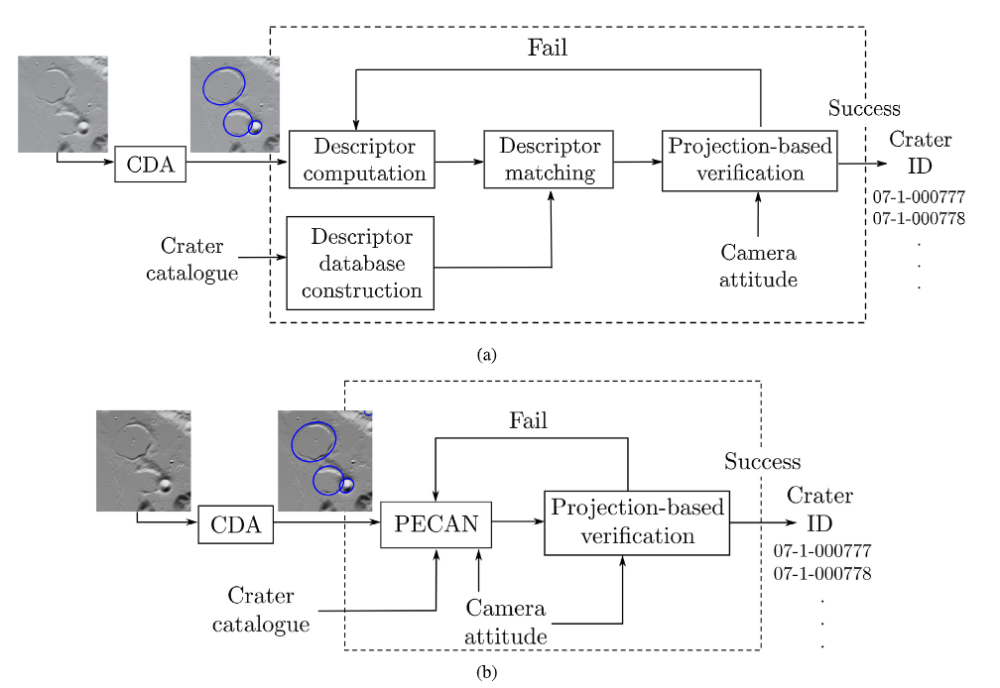
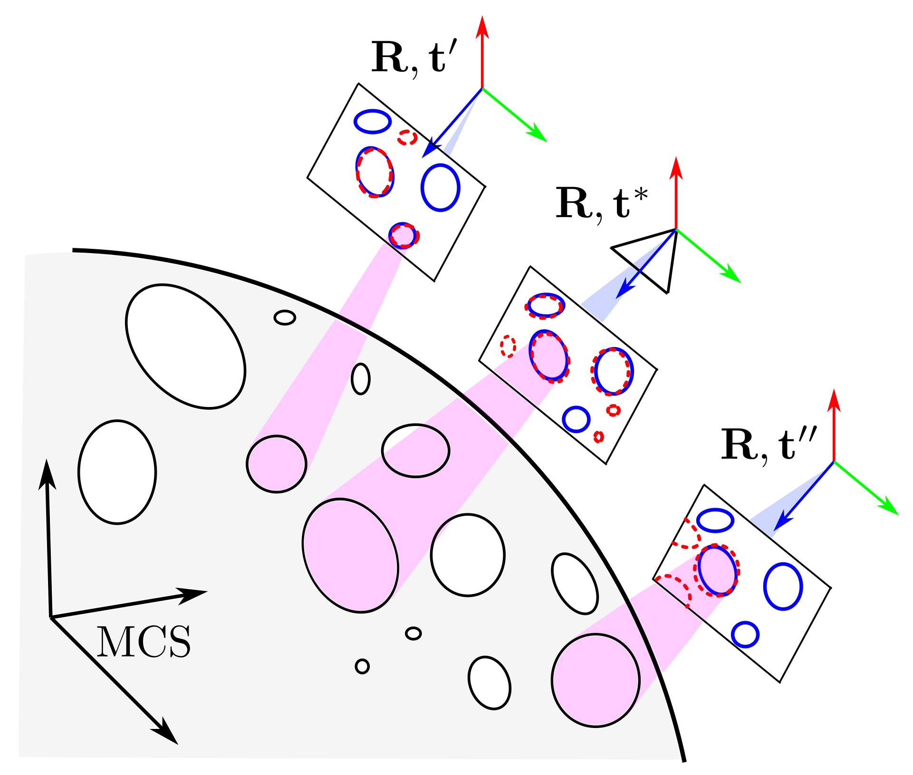

# Crater Identification by Perspective Cone Alignment
Welcome to the repository for the Crater Identification by Perspective Cone Alignment (PECAN). 

- Crater identification (CID) is essential for crater-based navigation in planetary missions, aiming to match observed craters to a known catalogue. 
- Existing CID methods use descriptors that often struggle with noise and rapidly growing indices as catalogue size increases. 
- PECAN is a descriptorless technique that iteratively solves the perspective cone alignment problem. 
- Notably, PECAN's onboard catalogue scales linearly with the mission catalogue. The 
- This approach is more accurate in noisy conditions and scales efficiently with linear time and space complexities, making it a robust solution for future planetary exploration.





The `environment.yml` file contains all the necessary libraries and the specific versions that the code was tested with.

An example of a testing data file is provided in the `data/` directory.

To run the code with the provided testing data and hyperparameters, execute the bash script:
```bash
bash run.sh
```

To use your own data, the following I/O adaptations are required:
 - Replace the calibration.txt file in the data/ directory with your own camera intrinsic parameters.
 - Replace the robbins_navigation_dataset.txt in the data/ directory with your own crater catalogue.
 - If you want to provide your own testing data, implement a custom I/O function to replace the testing_data_reading function (line 663) in PECAN.py. The minimum required input includes detected craters in ellipse form (x, y, a, b, theta) and the camera attitude.

## License
This source code is licensed under the [Attribution-NonCommercial 4.0 International (CC BY-NC 4.0) license](https://github.com/ckchng/PECAN/blob/main/LICENSE), which allows for free use in academic and research contexts. If you intend to use this code for commercial purposes, including a space mission, please contact us to obtain the appropriate licensing.


## Citation

If you find this code useful in your research, please cite our paper:

```bibtex
@article{chng2024crater,
  title={Crater identification by perspective cone alignment},
  author={Chng, Chee-Kheng and Mcleod, Sofia and Rodda, Matthew and Chin, Tat-Jun},
  journal={Acta Astronautica},
  volume = {224},
  pages = {1-16},
  year = {2024},
  issn = {0094-5765},
  doi = {https://doi.org/10.1016/j.actaastro.2024.07.053},
  url = {https://www.sciencedirect.com/science/article/pii/S0094576524004211},
  publisher={Elsevier}
}
